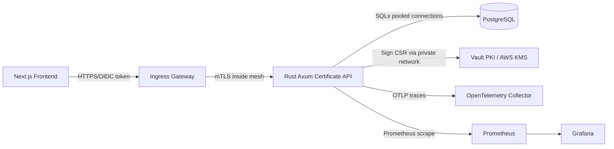

# Assignment 2: Secure Certificate Issuance Microservice Architecture

This folder contains a production-style architecture package for a Rust certificate issuance and inventory service. It is intentionally written as a system design assessment: the implementation skeleton shows module boundaries, while the documentation and manifests explain how the service would be deployed, secured, observed, and scaled in Kubernetes.

## What Is Included

- `docs/ARCHITECTURE.md` explains the end-to-end platform architecture and core design choices.
- `docs/SECURITY.md` explains API security, TLS, mTLS, secret handling, audit logging, and hardening.
- `docs/OBSERVABILITY.md` explains tracing, metrics, logs, dashboards, and alerting.
- `docs/PRODUCTION_HARDENING.md` covers scaling, reliability, supply-chain, and operations.
- `diagrams/architecture.md` provides Markdown-compatible Mermaid diagrams.
- `db/schema.sql` defines the PostgreSQL schema, indexes, and audit tables.
- `api/openapi.yaml` documents the REST contract.
- `k8s/` contains Kubernetes, Istio, and Prometheus/Grafana-oriented manifests.
- `src/` contains a Rust reference architecture skeleton using Axum, Tokio, SQLx, tracing, OpenTelemetry, and clean module boundaries.

## Architecture Summary

The service exposes a small API for certificate issuance and inventory. A client submits a CSR, the service validates policy, delegates signing to a CA abstraction backed by Vault/AWS KMS concepts, persists certificate metadata and audit records in PostgreSQL, and returns the issued certificate material. Internal service-to-service calls are protected by a service mesh using mTLS, while application-level authorization remains explicit in the API layer.

## Why This Shape

Rust, Axum, and Tokio are a strong fit for a security-sensitive microservice because they combine memory safety, low overhead, predictable concurrency, and a small framework surface. PostgreSQL is chosen because certificate inventory is relational, query-heavy by expiration/issuer/status, and benefits from mature indexing and transactional audit writes. Kubernetes provides deployment scheduling, rollout control, health checking, and autoscaling. Istio or Linkerd supplies identity-based mTLS without forcing each service to hand-roll TLS peer verification.

## Local Reading Path

1. Read `docs/ARCHITECTURE.md`.
2. Review `db/schema.sql` and `api/openapi.yaml`.
3. Review `k8s/` manifests.
4. Read `docs/SECURITY.md` and `docs/OBSERVABILITY.md`.
5. Study the Rust module skeleton under `src/`.

The detailed cross-assignment explanation lives in `../MASTER_DOCUMENTATION.md`.
