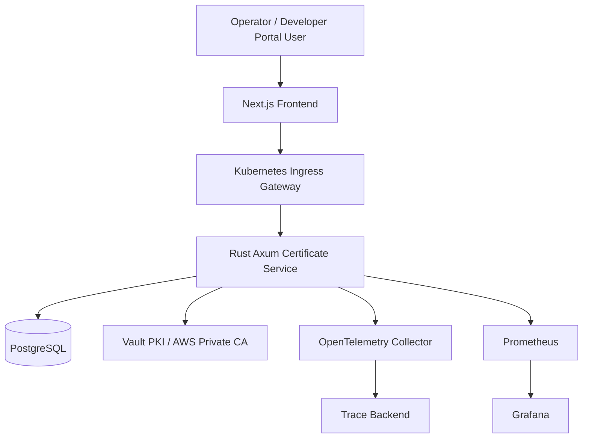
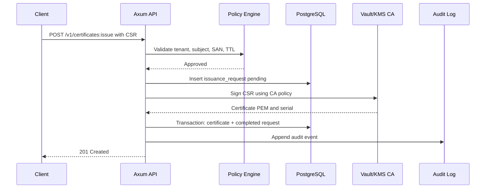

# Architecture Diagrams

## Context

```mermaid
flowchart TD
    User[Operator / Developer Portal User] --> Frontend[Next.js Frontend]
    Frontend --> Ingress[Kubernetes Ingress Gateway]
    Ingress --> Api[Rust Axum Certificate Service]
    Api --> Postgres[(PostgreSQL)]
    Api --> CA[Vault PKI / AWS Private CA]
    Api --> OTel[OpenTelemetry Collector]
    OTel --> TraceStore[Trace Backend]
    Api --> Prometheus[Prometheus]
    Prometheus --> Grafana[Grafana]
```

## Issuance Sequence

```mermaid
sequenceDiagram
    participant C as Client
    participant A as Axum API
    participant P as Policy Engine
    participant D as PostgreSQL
    participant V as Vault/KMS CA
    participant L as Audit Log

    C->>A: POST /v1/certificates:issue with CSR
    A->>P: Validate tenant, subject, SAN, TTL
    P-->>A: Approved
    A->>D: Insert issuance_request pending
    A->>V: Sign CSR using CA policy
    V-->>A: Certificate PEM and serial
    A->>D: Transaction: certificate + completed request
    A->>L: Append audit event
    A-->>C: 201 Created
```
